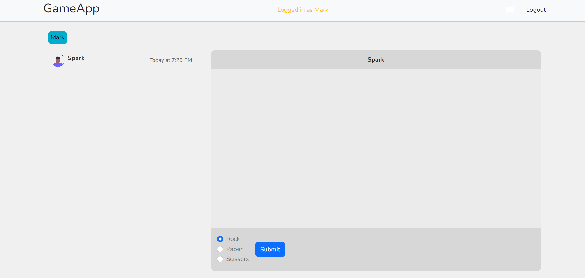
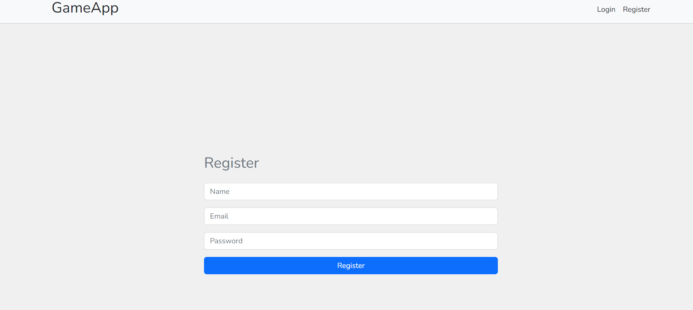

# rock-paper-scissors


## POC for the game rock-paper-scissors. 

### Implemented:
1. Registration
2. Authentication
3. Communication between clients and server using web sockets

## Setup

### Start server
1. ```cd server```
2. ```npm install```
3. ```node index.js```

### Start client
1. ```cd client```
2. ```npm install```
3. ```npm run dev```

# Main page


# Registration page

